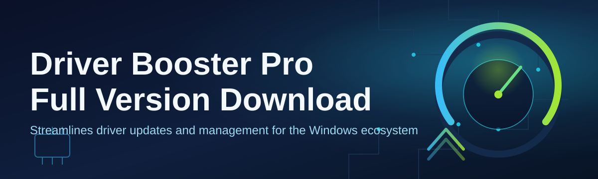

# driver-booster-pro-optimizer 🚀🛠️

  

*Your drivers, tuned like a race car before the checkered flag — one dashboard, zero guesswork.*

  

## 🔍 Overview

Before we go any further, here's the honest side-by-side. This is the table most people bookmark this repo for.

| | Manual Driver Hunting | Generic "Update All" Tools | **driver-booster-pro-optimizer** |
|---|---|---|---|
| **Time to update all drivers** | Hours of manufacturer-site diving | 20-30 minutes, often mismatched | Minutes, matched to your exact hardware |
| **Rollback safety** | Manual backup, easy to forget | Rarely offered | Built-in snapshot + one-click revert |
| **Offline / gaming drivers** | Scattered across forums | Sometimes bundled, often outdated | Curated, versioned, and dated |
| **System clutter** | Leftover installer files everywhere | Toolbars, "optional" extras | Clean install, nothing extra |
| **Interface** | N/A | Dated, ad-heavy | Modern, dark/light themes, keyboard-first |

> [!NOTE]
> This table reflects the general landscape of driver-management tools in 2026. Your mileage may vary depending on hardware age and vendor support.

**driver-booster-pro-optimizer** is a Windows-focused driver management and optimization utility built for people who are tired of chasing chipset pages, GPU vendor portals, and dusty motherboard support sites just to get a Wi-Fi adapter working again. If you've ever typed "driver booster pro full version download" into a search bar at 1 AM because your printer suddenly stopped talking to your laptop, this project exists for exactly that moment.

At its core, the tool scans your installed hardware, cross-references it against a maintained driver index, and highlights what's outdated, missing, or flagged as unstable — then gets out of your way so you can apply updates in bulk or one at a time. It's built for gamers chasing frame-time consistency, creators who need color-accurate GPU drivers, IT folks refreshing a fleet of machines, and everyday users who just want their peripherals to behave.

We built this because driver management shouldn't feel like archaeology. No digging through decade-old forum threads, no guessing which ".inf" file matches your silicon revision. Just a clear read of your system state and a straightforward path to getting current.

  

---

## ⚡ What It Actually Does

**Full Hardware Fingerprinting** — reads your motherboard, GPU, NIC, audio chipset, and peripheral tree in seconds, no guesswork about model numbers.

**Smart Version Matching** — cross-checks installed driver versions against a maintained index instead of blindly pushing "latest," which avoids the classic newer-but-worse driver trap.

**One-Click Batch Updates** — queue every outdated driver and let the tool work through the list sequentially, with progress shown per device.

**Snapshot & Rollback** — every update creates a restore point for that specific driver, so a bad GPU driver doesn't ruin your evening.

**Silent Background Mode** — runs scheduled scans without popping dialogs mid-game or mid-presentation.

**Game-Ready Driver Alerts** — flags GPU driver releases tied to major game launches or performance patches, so you're not the last one updated on release day.

**Junk Driver Cleanup** — removes orphaned driver packages left behind by uninstalled hardware, reclaiming disk space in the Windows driver store.

**Offline Driver Cache** — download once, apply on multiple machines without repeated network hits — handy for techs servicing several PCs.

> [!TIP]
> Pair the batch update queue with the snapshot feature before a major Windows update — it gives you a clean rollback path if a driver conflicts with the new build.

---

## 🧭 How to Get Started

1. **Visit the landing page** using the download button above — that's the only place this project distributes builds from.

2. **Download the installer** and run it — no dependency installs, no separate runtime required.

3. **Launch the app** and let the initial hardware scan finish; this usually takes under a minute on modern systems.

4. **Review the results**, pick individual drivers or hit the batch-update queue, and let it work through your list.

> [!IMPORTANT]
> Always download from the official landing page linked in this README. Third-party mirrors may bundle unrelated software or serve stale, unpatched builds.

---

## 🖥️ System Requirements

| Component | Minimum | Recommended |
|---|---|---|
| **OS** | Windows 10 (64-bit) | Windows 11 (64-bit) |
| **RAM** | 4 GB | 8 GB+ |
| **Disk Space** | 250 MB free | 1 GB free (for cached driver packages) |
| **Network** | Required for scanning/downloads | Broadband for faster batch updates |
| **Permissions** | Administrator (for driver installs) | Administrator |

Standalone executable — nothing else to install, no separate runtimes, no background services beyond the optional scheduler.

  

---

## ⚙️ How It Works

The workflow behind the scenes is intentionally simple, so nothing feels like a black box:

1. **Scan** — enumerate installed hardware and current driver versions via the Windows device tree.
2. **Match** — compare each device against the maintained driver index for known-good, current releases.
3. **Snapshot** — capture a restore point for any driver about to change.
4. **Apply** — install the matched driver package silently in the background.
5. **Verify** — confirm the device re-enumerates correctly and report success or a rollback prompt.

> [!NOTE]
> The verify step is what separates a smooth update from a stuck one — if a device doesn't come back online cleanly, the rollback path triggers automatically.

---

## 🩹 Troubleshooting

<strong>The scan finds hardware but shows no available updates — is that normal?</strong>

Yes. If your installed drivers already match the latest known-good versions in the index, there's simply nothing newer to offer. That's the tool working correctly, not a bug.

<strong>My GPU driver update failed halfway through.</strong>

Open the snapshot panel and roll back to the pre-update state, then retry with background apps closed (especially anything using hardware acceleration, like browsers or recording software).

<strong>Does this work on laptops with OEM-customized drivers?</strong>

Mostly, yes — but some laptop vendors ship modified drivers with vendor-specific power or thermal tweaks. The tool flags these separately so you can decide whether to keep the OEM version or move to the generic chipset driver.

<strong>A device disappeared from Device Manager after an update.</strong>

Use the rollback snapshot for that specific device first. If it's still missing, a reboot usually re-triggers Windows' Plug and Play detection.

<strong>Can I schedule scans without the app running visibly?</strong>

Yes — enable Silent Background Mode in Settings, and scans run on your chosen interval without any popup interruptions.

> [!WARNING]
> Never interrupt a driver installation mid-write (no forced shutdowns, no unplugging on laptops). Doing so can leave a device in a half-installed state that's harder to recover from than a normal failed update.

---

## 🎨 UI / UX Details

The interface is built to feel fast under your fingers, not just under the hood.

- **Themes** — Dark, Light, and an auto mode that follows your Windows theme setting.
- **Keyboard shortcuts:**
  - `Ctrl + S` — start a full scan
  - `Ctrl + Enter` — apply the current update queue
  - `Ctrl + Z` — open the rollback/snapshot panel
  - `Ctrl + ,` — open Settings
  - `Esc` — cancel an in-progress scan
- **Settings you can tune:**
  - Auto-scan interval (daily / weekly / manual only)
  - Notification style (toast, silent, or full popup)
  - Driver source priority (stability-first vs. latest-first)
  - Cache location for offline driver packages

> [!TIP]
> If you manage multiple machines, export your settings profile and import it on the next install — it saves you from reconfiguring everything from scratch.

---

## 🤝 Contributing & Community

We welcome issues, feature requests, and pull requests from anyone who's ever been frustrated by a stubborn driver.

- Open an issue for bugs, with your Windows build number and device model if relevant.
- Discussions are the right place for "how do I..." questions.
- Pull requests should target a clear, single change — smaller PRs get reviewed faster.

> Community-driven driver notes and edge-case